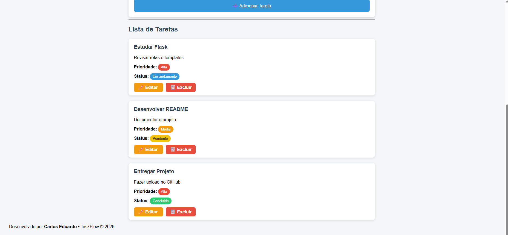
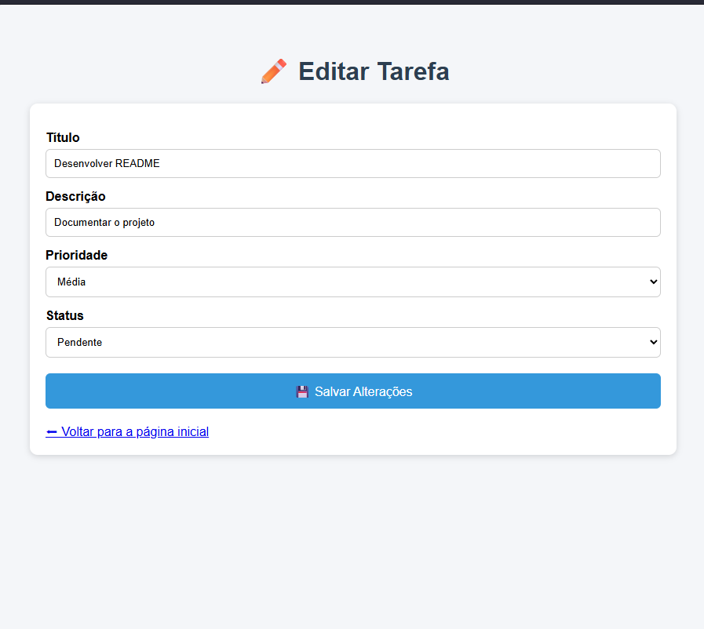

# 📋 TaskFlow


Sistema web para gerenciamento de tarefas desenvolvido com **Python** e **Flask**, como projeto da disciplina de **Engenharia de Software da UniFECAF**.

---

# 📑 Índice

- 📖 Sobre o projeto
- 🎯 Objetivos
- 🚀 Funcionalidades
- 🛠 Tecnologias utilizadas
- 📂 Estrutura do projeto
- ⚙️ Como executar
- 🧪 Testes automatizados
- 📷 Capturas de tela
- 🔄 Fluxo da aplicação
- 📌 Melhorias futuras
- 👨‍💻 Autor
- 📄 Licença

---

# 📖 Sobre o projeto

O **TaskFlow** é uma aplicação web desenvolvida para facilitar o gerenciamento de tarefas do dia a dia.

O sistema permite cadastrar, visualizar, editar e excluir tarefas de maneira simples e intuitiva, proporcionando uma melhor organização das atividades.

Além das funcionalidades da aplicação, o projeto também demonstra boas práticas de desenvolvimento de software, utilizando:

- Versionamento com Git;
- Hospedagem do código no GitHub;
- Integração Contínua (CI) com GitHub Actions;
- Testes automatizados utilizando Pytest.

Este projeto foi desenvolvido como atividade prática da disciplina de **Engenharia de Software** da **UniFECAF**.

---

# 🎯 Objetivos

- Desenvolver uma aplicação web utilizando Flask;
- Aplicar conceitos de CRUD;
- Utilizar Git e GitHub no controle de versões;
- Automatizar testes utilizando GitHub Actions;
- Praticar boas práticas de desenvolvimento.

---

# 🚀 Funcionalidades

- ✅ Cadastro de tarefas
- ✅ Visualização das tarefas cadastradas
- ✅ Edição de tarefas
- ✅ Exclusão de tarefas
- ✅ Definição de prioridade
- ✅ Controle de status
- ✅ Interface simples e responsiva
- ✅ Testes automatizados
- ✅ Integração contínua com GitHub Actions

---

# 🛠 Tecnologias Utilizadas

| Tecnologia | Finalidade |
|------------|------------|
| Python 3 | Linguagem principal |
| Flask | Framework Web |
| HTML5 | Estrutura das páginas |
| CSS3 | Estilização |
| Git | Controle de versão |
| GitHub | Hospedagem do projeto |
| GitHub Actions | Integração Contínua (CI) |
| Pytest | Testes automatizados |

---

# 📂 Estrutura do Projeto

```text
TaskFlow
│
├── .github/
│   └── workflows/
│       └── ci.yml
│
├── static/
│   └── css/
│       └── style.css
│
├── templates/
│   ├── index.html
│   └── editar.html
│
├── tests/
│   └── test_app.py
│
├── prints/
│   ├── tela-inicial.png
│   ├── sistema.png
│   ├── edicao.png
│   ├── github-actions.png
│   └── github-project.png
│
├── app.py
├── requirements.txt
├── pytest.ini
└── README.md
```

---

# ⚙️ Como Executar o Projeto

### 1️⃣ Clone o repositório

```bash
git clone https://github.com/eucarlosz/TaskFlow.git
```

### 2️⃣ Entre na pasta

```bash
cd TaskFlow
```

### 3️⃣ Crie o ambiente virtual

```bash
python -m venv .venv
```

### 4️⃣ Ative o ambiente

Windows

```bash
.venv\Scripts\activate
```

Linux / macOS

```bash
source .venv/bin/activate
```

### 5️⃣ Instale as dependências

```bash
pip install -r requirements.txt
```

### 6️⃣ Execute a aplicação

```bash
python app.py
```

Depois acesse:

```
http://127.0.0.1:5000
```

---

# 🧪 Testes Automatizados

Para executar os testes:

```bash
pytest
```

Caso todos os testes sejam executados corretamente, será exibida uma saída semelhante a:

```text
================== test session starts ==================

4 passed in 0.40s

================== tests passed =========================
```

---

# 📷 Capturas de Tela

## 🏠 Tela Inicial


---

## 📋 Sistema com Tarefas



---

## ✏️ Tela de Edição



---

## ⚙️ GitHub Actions


---

## 📌 GitHub Project (Kanban)


---

# 🔄 Fluxo da Aplicação

```text
Usuário
    │
    ▼
Interface Web
(HTML + CSS)
    │
    ▼
Flask
    │
    ▼
Python
    │
    ▼
Gerenciamento das tarefas
```

---

# 📌 Melhorias Futuras

- Sistema de login
- Banco de dados SQLite
- Banco de dados MySQL
- Pesquisa de tarefas
- Filtros por prioridade
- Datas de vencimento
- Responsáveis pelas tarefas
- Categorias
- Dashboard com estatísticas
- Responsividade aprimorada

---

# 👨‍💻 Autor

**Carlos Eduardo**

Desenvolvedor em formação, estudante de Engenharia de Software, com foco em desenvolvimento de aplicações utilizando Python, Flask, HTML, CSS e boas práticas de versionamento com Git e GitHub.

Projeto desenvolvido para a disciplina de **Engenharia de Software** da **UniFECAF**.

---

# 📄 Licença

Este projeto foi desenvolvido exclusivamente para fins acadêmicos como atividade da disciplina de Engenharia de Software da UniFECAF.

Seu uso é permitido apenas para estudos e aprendizado.

---

## ⭐ Gostou do projeto?

Se este projeto foi útil para você, deixe uma ⭐ no repositório.
